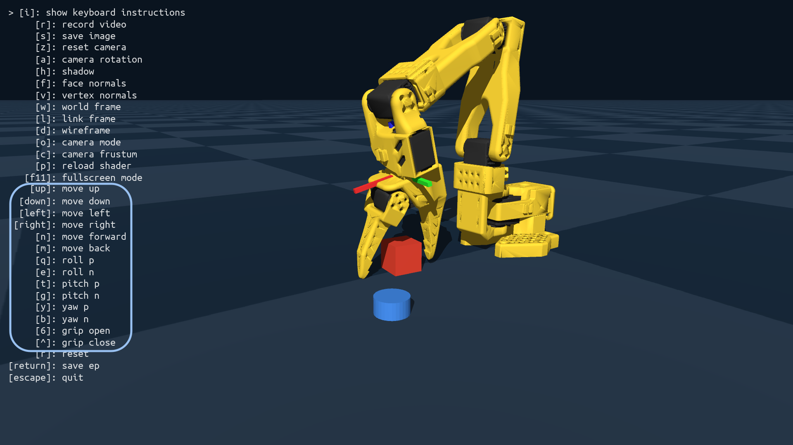
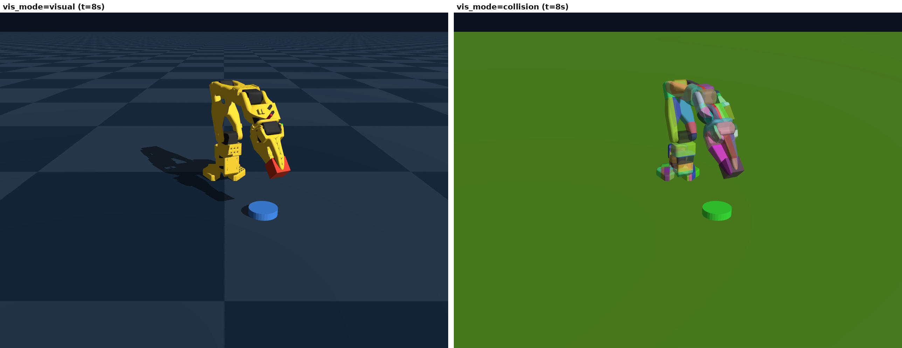
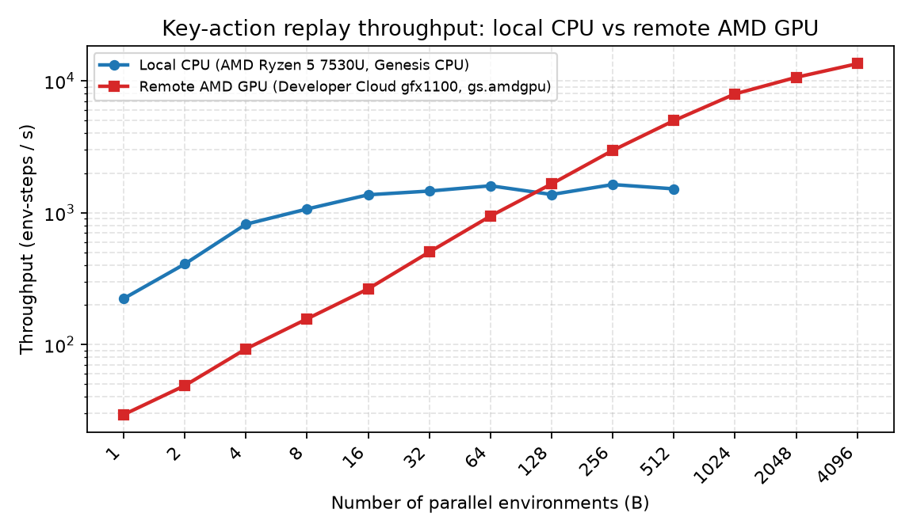

# ArmForge Technical Report

**Track 3 — Physical AI Challenge**  
**Team:** slobot  
**Application:** ArmForge  
**Source code:** [https://github.com/alexis779/slobot-armforge](https://github.com/alexis779/slobot-armforge)

## Overview

ArmForge is a ROCm-native pipeline for teaching an SO-ARM-101 manipulator to pick a cube and place it on a disk in Genesis. The stack centers on human key-action teleoperation, contact-stable simulation, LeRobot-shaped dataset export, and multi-environment throughput on AMD GPUs so the same teaching loop can feed reinforcement learning and real-robot workflows.

## Why teleoperation matters

Teleoperation is paramount when the goal is to teach AI a contact-rich pick-and-place skill. We first tried to learn cube→disk from scratch with PPO, SAC, and DQN (no behavior cloning). Under a ~1 hour GPU budget those runs did not produce a reliable policy: the issue was the Markov Decision Process (action space, reward, and task structure), not a shortage of parallel environments. Scripted motions and dense reward shaping also miss the timing, grasp commitment, and recovery behaviors that humans demonstrate under friction and partial observability. In ArmForge, an operator drives the SO-101 with keyboard key bindings that map to a 14-dimensional multi-hot action space (translations, roll/pitch/yaw nudges, and gripper open/close). Each simulation step records the held keys so idle and active frames are explicit. Those demonstrations become a LeRobot dataset: a full teleop episode and an idle-trimmed sibling that keeps only nonzero key-actions. The public release is available at [https://huggingface.co/datasets/alexis779/so101_cube_disk](https://huggingface.co/datasets/alexis779/so101_cube_disk), with the trimmed episode viewable in the LeRobot visualizer at [https://huggingface.co/spaces/lerobot/visualize_dataset?path=%2Falexis779%2Fso101_cube_disk%2Fepisode_1](https://huggingface.co/spaces/lerobot/visualize_dataset?path=%2Falexis779%2Fso101_cube_disk%2Fepisode_1). Teleop therefore supplies the successful grasp trajectories that from-scratch RL never sampled, which later RL or imitation methods can refine.

## Why keyboard teleoperation

ArmForge uses keyboard teleoperation instead of a leader–follower arm pair so teaching stays accessible. A 2nd physical SO-101 (or other leader) is not required, nor is calibrated bimanual hardware, serial wiring, or a dedicated teleop station. Any machine that can run Genesis with a display and a keyboard can collect demos—on a laptop, an AMD Developer Cloud desktop session, or a ROCm workstation—without buying or shipping extra robot hardware. Discrete key bindings also match the multi-hot action representation used for replay and discrete RL (DQN), so the same interface that a human presses is the action space the policy can learn.

## Cartesian control in the wrist frame

A second design choice is to command the arm in Cartesian end-effector space rather than joint space. Nudging individual joints is unnatural for pick-and-place: small joint deltas produce curved, coupled tip motion that is hard to aim at a cube or disk. Cartesian keys (“move forward”, “up”, “left”) match how people think about reaching, while inverse kinematics maps those tip targets onto joint commands behind the scenes. Translations are applied in the current wrist / end-effector frame, not the world frame: “forward” means along the gripper’s facing axis, and “up” stays aligned with the tool even after the wrist has been reoriented. That body-relative mapping keeps the same key meanings consistent as the grasp rotates, whereas world-frame axes would force the operator to remint mental coordinates after every roll or yaw. Genesis solves IK for the updated tip pose each step so the human stays in task space while the robot stays within joint limits.

## Key bindings

| Key | Action |
|-----|--------|
| Up | Move end-effector up (+Z in EE frame) |
| Down | Move end-effector down (−Z) |
| Left | Move end-effector left (−Y) |
| Right | Move end-effector right (+Y) |
| N | Move end-effector forward (−X) |
| M | Move end-effector back (+X) |
| Q | Roll + |
| E | Roll − |
| T | Pitch + |
| G | Pitch − |
| Y | Yaw + |
| B | Yaw − |
| 6 | Gripper open |
| ^ | Gripper close |
| R | Reset episode (discard buffer) |
| Enter | Save episode |
| Esc | Quit |

## Accurate collisions with CoACD

Accurate collision geometry is a prerequisite for that contact-rich teaching. A single convex hull per robot link is cheap but wrong for the SO-101’s concave gripper and articulated links: hulls inflate volume, cause false contacts, and make pinching a cube unreliable. ArmForge enables convex decomposition through CoACD by setting `convexify=True` and forcing `decompose_robot_error_threshold=0.0` on the MJCF morph so every link is decomposed instead of remaining hull-only. The resulting collision meshes track the visual shape closely enough that jaw closing can capture the cube without phantom collisions from oversized hulls, which is essential for repeatable pick-and-place demos and for RL that depends on the same contact events.

## Simulation timing

Teleop and replay run at `fps=30`, so the Genesis control timestep is `dt=1/fps` (about 33 ms per step). Within each control step the rigid solver advances with `substeps=8`, refining contacts and constraints between recorded key-actions.

## Noslip iterations for stable grasps

Even with good meshes, rigid-body solvers can allow the grasped object to slip between the fingers under gravity and inertial loads. Genesis exposes `noslip_iterations` on the rigid options; ArmForge sets this equal to `substeps` (`noslip_iterations=8`) during teleop and replay so the constraint solver spends 1 noslip pass per substep suppressing relative tangential motion at contacts. Without those iterations the cube tends to ooze out of the gripper during lift or transport, poisoning both human demos and policy learning. CoACD and noslip therefore work together: CoACD places contacts where the real geometry is, and noslip keeps the contact manifold stuck during the pick.

## Multi-environment simulation: CPU cores versus GPU shaders

Once demos exist, scaling experience collection becomes the bottleneck. Genesis can step many environments in one batched call. On a CPU that parallelism is bounded by a small number of general-purpose cores. A modern laptop or workstation might expose on the order of tens of logical cores; beyond roughly that width, additional environments contend for the same cores and throughput plateaus. Our local CPU key-action replay already shows this: env-steps per second climb from a few hundred at `B=2` toward about 1600 by `B=64`–`B=256`, then flatten near 1500–1600 even at `B=512`. A GPU, by contrast, exposes thousands of shader (compute) units designed for the same kernel across many data-parallel instances. Rigid-body steps, batched kinematics, and vectorized policy inference map naturally onto that SIMD style of work. Multi-environment simulation is therefore particularly relevant for GPU training compared with CPU training: the GPU’s advantage is not merely clock speed, but width—many more concurrent lanes than CPU cores—so large environment batches keep the device busy while a CPU saturates early.

The chart compares local `gs.cpu` throughput on an AMD Ryzen 5 7530U (12 threads) against remote AMD GPU throughput on AMD Developer Cloud (`gfx1100`, `gs.amdgpu`) for the same key-action episode replay workload. At small `B` the CPU is faster because the GPU pays launch and host–device overhead. From about `B=128` upward the remote AMD GPU overtakes and keeps climbing (about 5000 env-steps/s at `B=512`, about 13500 at `B=4096`) while the CPU remains flat—exactly the cores-versus-shaders gap that matters for RL data collection.

## GPUs for reinforcement learning

That width makes GPUs a strong fit for reinforcement learning algorithms such as PPO, SAC, and DQN. These methods consume large volumes of transitions, benefit from decorrelated rollouts across parallel envs, and interleave simulation with neural network updates that already run on the accelerator. ArmForge trained from-scratch teachers on Genesis vectorized envs: continuous control with rsl-rl PPO and Stable-Baselines3 SAC, and discrete control with Stable-Baselines3 DQN, at hundreds to thousands of parallel environments per worker. The same AMD ROCm path used for teleop (`gs.amdgpu`) is the intended backend for collecting those rollouts on Radeon hardware, with Docker packaging for Developer Cloud and local ROCm setups.

Those teachers were **privileged-state** policies: they did not see cameras. A privileged observation is simulator ground truth a real robot would not get for free—fingertip pose, cube pose, disk pose, joint angles (`qpos`), a holding flag, and the last action—with `enable_cameras=False`. That is easier than vision (the network does not have to infer object poses from RGB), but it is not a demonstration: the policy still has to discover a grasp from its own actions. The hot path stays physics, kinematics, and network updates, which can run on `gs.amdgpu`. Madrona’s batched renderer remains CUDA-only; a vision-based student would still need rasterizer cameras or a CUDA path for image observations, but state-based PPO, SAC, and DQN do not. When visual observations are required and neither Madrona nor a suitable AMD rasterizer path is available, the workaround is to run on CPU only (`gs.cpu`): simulation and (slower) rasterizer cameras stay correct, at the cost of the multi-env scaling shown above.

## Why from-scratch RL failed

Privileged state and GPU width were not enough. The requirement was RL from scratch—no behavior cloning, no human trajectories in the buffer—on cube→disk pick-and-place, with about one hour of GPU time. Extra PPO/SAC/DQN iterations were not the bottleneck. Parallel envs multiply samples of the same Markov Decision Process (MDP); they do not create successful grasps if a completed episode is almost never sampled, so the critic has nothing to reinforce.

| Approach | Action space | Parallel envs | Budget | Outcome |
|---|---|---|---|---|
| Joint PPO (`pick-v2`) | 6 continuous DoFs (5 arm joints + gripper) | 256 | 1000 iters ≈ 6.1M steps | Train success **0%** throughout |
| Joint PPO, 1h scale | same | 4096 | 300–3600 iters (up to ~350M steps) | Dense reach/grasp rose; **place/success stayed 0%** |
| SAC | same joint MDP | 4096 | ~1h scale | Same pattern: **no held places** |
| DQN, teleop keys | `Discrete(14)` | 512 | ~3.7M steps, ~15k episodes | **0 / 14,848** successes |

Algorithm choice and wall-clock were secondary to how the MDP defined actions and reward.

**Action space.** A successful episode is a long, ordered chain: reach the cube, close at the right pose, lift without drop, carry, align over the disk, open, and hold for 0.2–0.3 s, inside a 6–8 s episode (`dt = 0.02` s, 300–400 steps). In joint space that is a 6-D continuous control problem; a random policy almost never completes it. Discretizing to 14 teleop keys does not help. DQN explores with ε-greedy: most steps follow the current Q-max action, and with probability ε it picks uniformly among the 14 discrete actions. A pick still needs the right actions *in order* for many steps. The space of sequences is \(|A|^T\) — about \(14^{400}\) for a 400-step episode — so a random rollout almost never finishes the chain by chance. One mistimed open or a bump that knocks the cube away ends the episode. Without that first lucky success, Q-learning has no held-place return to propagate.

**Reward.** Pick requires contact, but most random contacts knock the 3 cm cube away. Dense `reach` / `place` / `approach` terms then become a trap: the policy farms proximity without a held place. Penalizing collisions would suppress the grasp; rewarding contact without a place constraint produces hovering. There is no cheap shaping that both discovers the pinch and preserves the cube.

**Task.** Pick is contact-rich and bottlenecked. Until the gripper actually holds the cube, later place rewards are unreachable. A push task (Push-T, or our earlier cube-slide with the gripper pinned open) is easier: any contact that reduces cube–disk distance is progress, and a lucky brush can succeed. We started from that push MDP, then switched to pick-and-place; from-scratch RL did not follow.

Human key-action teleoperation therefore sits at the center of ArmForge: it supplies the rare successful trajectories instead of asking RL to invent pinch physics from noise. GPU multi-env throughput remains the way to scale any later fine-tuning that starts from those demos.

## How GPU scaling speeds up training

Empirically, GPU throughput continues to scale with environment count long after CPU scaling stalls. On an AMD Developer Cloud `gfx1100` node, key-action multi-env replay rises from tens of env-steps per second at `B=1` to thousands at hundreds of environments and into the 10000+ range near `B=4096`. That curve matters for training time: wall-clock progress in PPO, SAC, or DQN is largely proportional to how many environment steps you can gather per second. When each extra environment still adds useful parallel work on the GPU’s shaders, the same hyperparameter schedule finishes sooner; when a CPU has already exhausted its cores, buying more environments mostly adds scheduling overhead. Multi-env Genesis on AMD GPUs therefore remains the right scale-up path once human demos exist: teleoperation provides the contact-rich successes that from-scratch RL never found, and ROCm-native batched simulation can multiply them.
